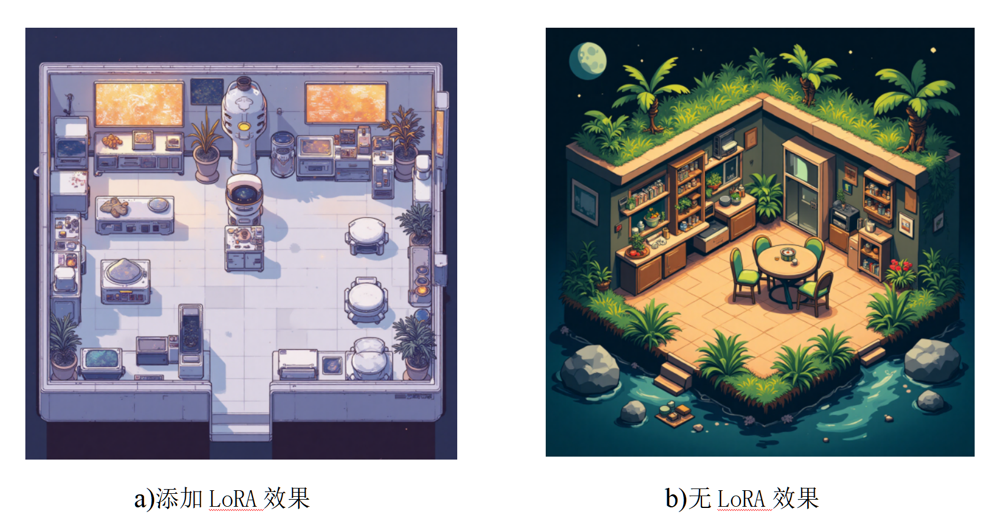

# 俯视游戏房间 LoRA 模型

你好！这是一个专为AI绘画设计的LoRA模型，能帮你轻松画出**俯视视角的游戏房间**。如果你是AI绘画新手，不用担心，我会用最简单的方式来介绍它。

## 什么是LoRA模型？

LoRA就像是一个AI绘画大模型（比如Stable Diffusion）的“小插件”。它不是一个独立程序，而是需要和大模型一起用。它的作用是让大模型学会画出某种特定风格或内容，而且文件很小，使用起来很方便。

我们这个LoRA模型，就是专门用来画那种你玩游戏时从上方看下来的“俯视房间”的！

## 它有什么特别之处？

*   **解决痛点：** 经过大量训练，它能很好地解决AI绘画模型在生成俯视房间时，经常出现视角不统一、画风不稳定的问题。
*   **效果出色：** 配合其他AI绘画大模型使用时，它的表现非常优秀，能帮助你画出高质量的俯视房间。

## ⚙️ 推荐参数

这是使用本LoRA模型时的一些推荐设置，希望能帮助你获得更好的效果：

*   **推荐搭配 (Checkpoint):** F.1 | VIVIDLY LIFELIKE 栩栩如生_二次元_V3
*   **推荐权重:** 0.8
*   **CFG:** 3.5
*   **VAE:** 无

## 开源与商用

*   **自由使用：** 你可以随意学习、使用它，做任何你想做的事。
*   **允许商用：** 即使你用它生成的图片来做商业用途（比如销售），也是完全没问题的。

## 国内用户

如果你是国内用户，可以访问我的Liblib.art主页，查看更多详细信息和作品示例：

[点击这里访问 Liblib.art](https://www.liblib.art/modelinfo/3cc760a281ca40fda11203d74b7608b8?from=personal_page&versionUuid=40e13b3711104f0bbf8f670019066e43)

希望这个LoRA模型能帮助你的AI绘画更上一层楼！🎨 
